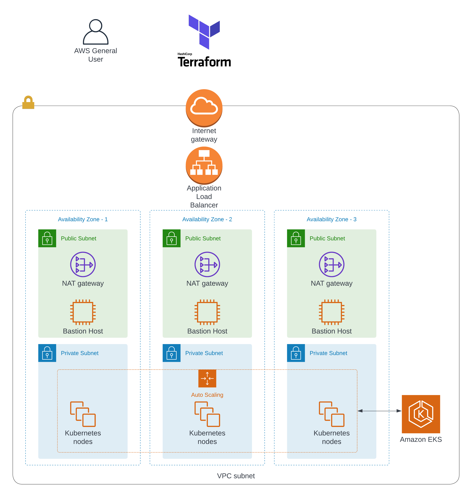

# terraform-eks

A set of Terraform template used for provisioning different kind application stack on AWS.

Templates are designed to be customized and enhance reusability.

## Components

| Name | Description |
|------|-------------|
| setup-backend | Setup Backend for AWS |  
| vpc-lb-eks | Create whole infrastructure | 

## Infrastructure Diagram



Dependent Component:

- Step1. setup-backend
- Step2. vpc-lb-eks

## Terraform Version

```bash
$ terraform version
Terraform v1.1.8
```

## Usage

```bash
# Move into the  directory
$ cd <component>
# Initialize Terraform to run
$ terraform init
# Executes the Terraform run
$ terraform apply
```

